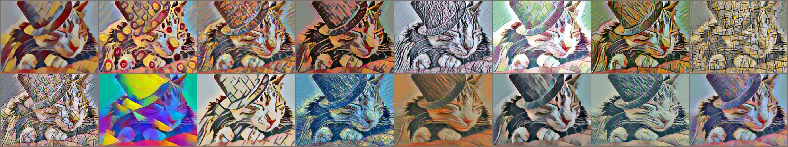

A Learned Representation For Artistic Style
==

* Unofficial Pytorch Implementation of "A Learned Representation For Artistic Style"
* Reference: https://arxiv.org/abs/1610.07629

 

## Usage
### Dataset
  - Content: MSCOCO 2014 train
  - Style: ./imgs/style (manually collected images)
    
    - The `style_index` starts in order from the top left (0 ~ 15).
  - Trained Model Weights: [Link](https://github.com/tyui592/A_Learned_Representation_For_Artistic_Style/releases/download/v1.0/model.ckpt)

### Example Scripts

```bash
# Model Training.
python main.py --mode 'train' \
    --style_path "./imgs/style/" \
    --content_path  "/path/to/content/dataset/"
    
# Model Evaluation.
python main.py --model 'eval' \
    --content_path "./imgs/gentlecat.png" \
    --style_index -1 (0~15 for a specific style, or -1 for all styles)
```
